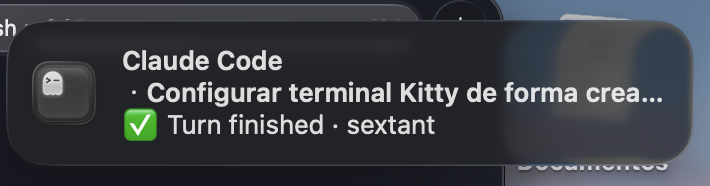

# claude-code-ghostty

Native **Ghostty** desktop notifications for **Claude Code** — when Claude is
waiting for your input, asks for permission, or finishes a turn.

Zero build, no compiled helper app, no Xcode. Just shell + Ghostty's native
notification support. The only runtime dependency is `jq`.

> **`ghostty-notify`** is the plugin shipped by this marketplace.



## What you get

- 🔔 **Notifications** on three Claude Code events:
  - `⌛ Waiting for your input` — Claude has been idle waiting for you
  - `🔐 Permission for <tool>: <preview>` — Claude wants to run a tool
  - `✅ Turn finished` — Claude completed the turn
- 🎯 **Click-to-focus** — clicking a notification focuses the Ghostty tab it came from.
- 🤫 **Per-tab suppression** — no notification while you're looking at that tab.
- 🧰 Each message is suffixed with the project name (the cwd basename).

Click-to-focus and per-tab suppression are **handled natively by Ghostty's OSC
777 implementation** (verified on Ghostty 1.3.x) — this plugin simply wires
Claude Code's hooks to it, so there is nothing native to build or maintain.

## Requirements

- **Ghostty** (macOS). `desktop-notifications` is on by default.
- **`jq`** (`brew install jq`).
- **Claude Code**. Versions `>= 2.1.141` use the `terminalSequence` hook output;
  older versions fall back to writing to `/dev/tty`.

## Install

```text
/plugin marketplace add ishtartec/claude-code-ghostty
/plugin install ghostty-notify@claude-code-ghostty
```

Then start a new Claude Code session (hooks load at session start). Manage or
toggle it anytime from `/plugin`.

### One-time macOS setup

So the banners actually appear on screen:

1. **System Settings → Notifications → Ghostty** → *Allow notifications* on, and
   set the alert style to **Banners** or **Alerts** (not *None*).
2. If you use a **Focus** mode (e.g. "Work"/"Do Not Disturb"), add **Ghostty**
   to that Focus's allowed apps — otherwise notifications are silently routed to
   Notification Center.

## How it works

The plugin registers three Claude Code hooks (`Notification` with the
`idle_prompt` matcher, `PermissionRequest`, and `Stop`). Each builds a short
message and emits an **OSC 777** notification sequence
(`\033]777;notify;<title>;<body>\007`). On Claude Code `>= 2.1.141` it is
delivered via the `terminalSequence` hook-output field; otherwise it is written
to `/dev/tty`. Ghostty turns the sequence into a native macOS notification.

The plugin only acts under Ghostty (`GHOSTTY_RESOURCES_DIR` / `TERM` /
`TERM_PROGRAM`); in any other terminal it is a no-op.

## Design: pure shell, no helper app

Some Ghostty notification tools ship a small native helper app (e.g. in Swift)
that posts notifications through macOS's `UNUserNotificationCenter` and focuses
the exact pane via the Accessibility / AppleScript APIs. That buys **per-pane**
precision and works independently of Ghostty's OSC handling — at the cost of a
build step (Xcode Command Line Tools) and Accessibility permissions.

This plugin takes the opposite trade-off: **no build, no extra permissions**. It
relies on Ghostty's own OSC 777 handling, which on recent Ghostty already does
per-tab suppression and click-to-focus. The one thing it does not do is target a
specific *pane within a tab* (Ghostty focuses the tab; a notification from a
split pane may not focus the exact pane). If you need per-pane precision, a
native helper-app approach is the better fit.

## License

MIT — see [LICENSE](LICENSE).
